# Status Pet 🐳

**A tiny pixel-art whale maid who lives in the DSH composer dock and shows you,
at a glance, what your agent is doing.** She naps when nothing is happening,
gets busy while a tool runs, holds up a warning when the agent is blocked on
*your* approval, throws sparkles when a turn lands, and looks sheepish with a
drop of sweat when one fails. Click her and the big picture opens above the
dock — pet her *there* and she hops with a little heart.

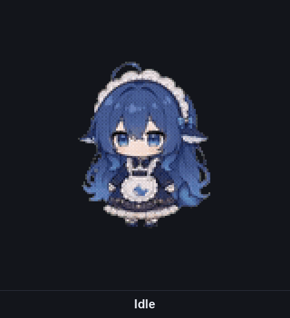


> Every image in this README is rendered from the shipped artwork by
> [`tools/gen-readme-media.py`](tools/gen-readme-media.py) — it is the same
> pixel data the pet draws, not a mockup.

## Why it exists

An agent turn is a long silence. You send a message, the transcript sits still,
a tool runs for twenty seconds, and the one thing that actually deserves to
interrupt you — *it is waiting for your approval* — is a bubble somewhere in the
scrollback. The pet turns that into something you can read out of the corner of
your eye, without reading anything.

She is not a spinner with a few loops, either: **idle alone is 61 animations**
(breathing, blowing bubbles, spinning a top, building a snowman…), and each one
holds the screen for a few seconds before the next is rolled — so the dock is
alive without ever being frantic. Yes, one of the "running a tool" animations is
her eating a token.

## Every state

| | State | You see it when |
|---|---|---|
| 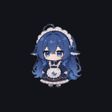 | **Idle** · 空闲 | nothing is running — one of **61 everyday animations**: breathing, blowing bubbles, brushing her teeth, spinning a top, swinging on a swing, petting a cat… |
| 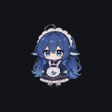 | **Sleeping** · 睡觉中 | nothing has happened for a minute — dimmed, eyes closed |
| 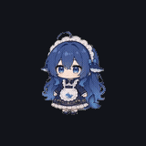 | **Thinking…** · 思考中… | busy with no output yet — she reacts the instant you hit send |
| 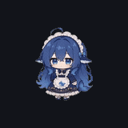 | **Responding…** · 回复中… | output is arriving: assistant text, or a tool call's arguments still being written |
| 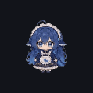 | **Running a tool…** · 正在执行工具… | a tool call is executing — hover to see *which* tool |
| 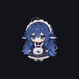 | **Waiting for your approval** · 等待你批准 | **the agent is blocked on you** — wide eyes, and the pill pulses |
| 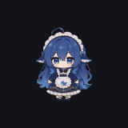 | **Waiting for your answer** · 等待你回答 | **the agent asked you something** — pulsing pill |
| 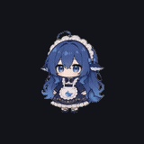 | **Something went wrong** · 出错了 | the last turn — or a send/stop — failed; the pill tints red |
| 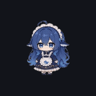 | **Done** · 已完成 | a turn finished and you haven't looked at it yet |

Two of those are the useful ones: **approval** and **question** are the moments
the agent cannot proceed without you.

Her two reactions, which are artwork too:

| | Reaction | When |
|---|---|---|
| 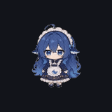 | **Blushing** · 害羞了 | the moment you click her in the popup |
|  | **Woken up** · 被叫醒了 | you hover or tab-focus her while she is asleep |

## Using her

| Trigger | What happens |
|---|---|
| **Click** the dock pet | Opens the **big-picture popup** above the dock: the most detailed version of the current skin, animated. A second click, Escape, or a click outside closes it. (The dock pet itself does not react — it is the way in.) |
| **Click anywhere in the popup** | She hops with a little heart for ~0.9 s and the caption flips to the reaction's name. The whole panel pets her, padding and caption included. |
| **Hover** her while she sleeps | She wakes up. |
| **Tab-focus** her while she sleeps | She wakes up too — nothing here is mouse-only. |
| **Hover** her at any time | The tooltip names the current state, instantly (no dwell) — and while a tool runs, it names the tool itself. |

Clicking is not the only thing the dock tells you: **three states tint or pulse
the pill itself** (approval, question, error), so the status bar carries the
signal even when your eyes are on the chat.

### The two crops, and the size you actually see

She is drawn as two crops of one character — a 32×32 avatar bust for the dock,
a 128×128 full body for the popup. Both are rendered at one sprite pixel per
canvas pixel and then shown at **half** (an exact 1:2, so every displayed pixel
lands on one source pixel and nothing blurs); the Settings previews show them
1:1 instead, which is the point of having bigger crops.

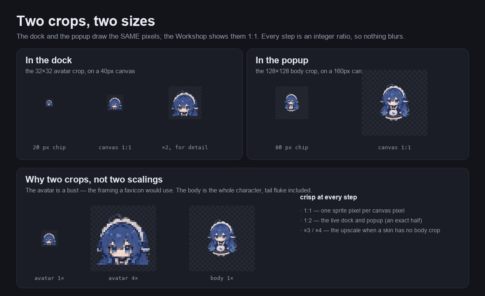

## Make her yours 🎨

The plugin ships one skin, **Whale-chan** (鲸鱼娘) — a white lace headdress with
a DeepSeek-blue bow, navy hair with bright blue tips, whale-fin ears, and an
apron with a tiny whale logo. Everything else is yours to draw:

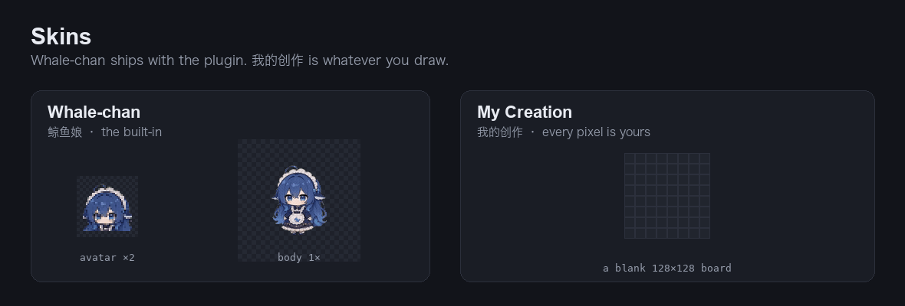

- **Skins** — pick Whale-chan, or **我的创作 / My Creation**, which starts as a
  copy of the current skin and is then yours. Switching applies instantly, no
  reload. To change a built-in's pixels or colours, take it into 我的创作.
- **An action library, not eleven separate animations** — each crop holds ONE
  library of **actions** (up to 128), and every state simply **ticks the ones it
  plays** (编辑 · 按状态). Up to **8 frames** per action, each frame a full grid you
  paint freely in 编辑 · 按动作 — one click, one pixel, **no forced mirroring**, so
  a wink is drawable. Tick one action in several states and it is *reused*: the
  editor says 「被 3 个状态在用」, and editing it once changes all three. A state
  with nothing ticked follows Idle. **导入动作** fills a slot instead of growing
  the library: pick one of the built-in animations (吃年糕, 吐泡泡, 原地360°旋转…
  — the picker has a search box and thumbnails) or one of your own, and it
  replaces the action you are editing — same slot, so the states that played it
  still do, with one 撤销 to get your drawing back. Per-frame timing and a
  whole-frame nudge (the way to
  make a bob or a sway) are in the frame row; each action also carries one shared
  pace. Undo/redo, a frame clipboard, and JSON import/export are all there.
- **The paint box** — six free colour wells beside the board. Click one to paint
  with it, click it again to change its colour with your OS picker. What you
  paint with is baked into the pixels, so editing a brush never repaints what
  you already drew. Right-click a pixel to pick its colour up onto the current
  brush; the `×` well erases. Your paint box survives a reload.
- **Both crops** — draw the 32×32 avatar and the 128×128 body. A skin with no
  body crop falls back to the avatar at a crisp 4× upscale, and the studio can
  seed your 128×128 draft from the avatar in one click.

Nothing you can do in the studio can break the pet: every load validates the
stored artwork, and a corrupt or hand-edited store falls back to the whale
instead of blanking her.

## Install

Install the bundle from this directory with the DSH plugin manager — use the
absolute path of the checkout:

```
plugin_manager install_bundle /absolute/path/to/dsh-status-pet
```

Without the agent tool, the CLI equivalent is:

```bash
dsh plugin --profile <profile> add /absolute/path/to/dsh-status-pet
```

…followed by a row in that profile's `cordis.patch.yml`:

```yaml
- insert:
    - id: status-pet
      name: '@local/dsh-status-pet'
```

Then look at the composer dock — the status bar above the chat input. She
appears as a pill with a tiny pixel whale inside, gently bobbing, at the **far
left** of the row (left of the built-in pills). Send a message and watch her
change; hover her to see the state named.

## Her settings tab

Open DSH Settings and pick **状态宠物 / Status Pet** in the nav. The page is the
skin cards on top, then two tabs:

- **预览 / Preview** — two ways of looking at the same artwork. **按状态** is
  the result: eleven live pets, one per state, each animated with that state's
  real motion and badged with what it plays (「3 个动作」 or 「跟随空闲」 — the one
  place a state you forgot to tick anything for is visible). **按动作** is the
  material: every action in the library, live, including the ones no state plays
  yet, each labelled with the states that do. Hover a state cell and the tooltip
  says what the state means. Every STATE cell wears a small **✎** in its top-right
  corner — click it to jump straight into 编辑 with that state in front of you —
  and on 我的创作 an action cell has one too, jumping into the studio with that
  action on the board.
- **编辑 / Edit** — the same two words, the same two modes, but this time you
  are changing things. **按动作** is the pixel studio: an **action dropdown** picks
  the one action on the board, then 画布 / 画笔 / 帧 / 当前帧 below it, with
  新建动作 / 删除动作 / 导入动作 beside it (no 复制动作 — 导入 into a new slot is the
  same job). **按状态** is
  where the library lives: a **state dropdown** picks which state you are ticking
  for, then one checkbox per action says whether that state plays it, with
  全选 / 清空 beside it. The two never mix — nothing on the
  studio page mentions a state, and nothing on the assignment page mentions a
  paint brush. **A built-in can be re-assigned, never re-drawn**: its 编辑 tab is
  there, but the switch drops 按动作 — a built-in keeps its pixels, so what you
  change is only which of its own actions each state plays (the pet updates
  instantly, and 我的创作 is not created behind your back).  Drawing, importing
  actions and the paint box are 我的创作's alone.

The **32 / 128** switch sits on the tab row, because it belongs to both tabs: it
is the crop you look at *and* the crop you edit. The board is a square that can
only ever be as large as the pane gives it: the whole 128×128 crop is visible at
any width, and it never scrolls sideways.

## Good to know

- **She sits at the far left, fixed.** That is deliberate, not a missing
  setting: the dock's trailing "context used" meter is drawn by the host
  *outside* the slot, so a "rightmost" pet could never actually be rightmost,
  and a half-working position setting would just look like a bug.
- **She is a read-out; the popup is the toy.** The dock pill only opens the
  popup. Petting, and anything more involved, belongs behind that click.
- **Reduced motion is honoured** — `prefers-reduced-motion` freezes her on each
  animation's first frame and disables the pulse.
- **A hidden tab costs nothing** — the animation loop stops while the tab is in
  the background and resumes when you come back.
- **Bilingual** — every visible string follows the DSH UI language (English and
  中文 ship).
- **No polling, no runtime dependencies** — she reads the session through the
  slot's standard props with narrow selectors, and the shipped artifact is plain
  JS plus the React the DSH web shell already has.
- **Skins are data** — a skin is one artwork document (a palette, a per-crop
  action library, and which action ids each state plays), which is why a built-in
  and 我的创作 are the same thing and both are swappable at runtime.
- **Old drawings are upgraded, not dropped** — a store from the previous schema
  is converted on read, and the conversion *shares*: a take that used to be
  copied into three states becomes one action they all reference.

---

<details>
<summary><b>For developers</b> — architecture, files, dev loop, tests</summary>

### Layout

```
dsh-status-pet/
├── package.json        bundle metadata, exports, client injection config, scripts
├── cordis.patch.yml    the Cordis patch that inserts the plugin row
├── index.js            Host half (no-op — everything is client-side)
├── client.js           BUILD ARTIFACT (gitignored): the plugin bundle
├── client.artwork.js   BUILD ARTIFACT (gitignored): the frames, fetched on demand (15.6MB)
├── src/                the real TypeScript source
├── test/               node:test suite (no browser, no DOM)
├── bench/              the performance harness (`pnpm bench`) — not shipped
├── tools/              the artwork pipeline and the README media generator (not shipped)
└── AGENTS.md           the full architecture & contributor reference
```

`src/` is organized as a pet system, not as plugin plumbing: `pet/` is the pet
itself (pure data and pure functions — no DOM, no React, node runs it directly),
`renderer/` draws and animates it, `ui/` is where it lives, and the two root
files are the plumbing.

| File | What lives there |
|---|---|
| `pet/behavior.ts` | `TUNING` rhythm knobs, the pure `derivePetState` state machine, the state vocabulary and the reaction table |
| `pet/grids.ts` | Body plan: both grids' geometry (`canvasW/H`, `baseY`, `padX`, `maxOffset`) and `LIVE_ZOOM` |
| `pet/labels.ts` | Every visible string, en + zh, plus the translator fallback |
| `pet/skins/` | The wardrobe, one concern per module: the model (`compose.ts`), validation (`validate.ts`), the upgrade door (`convert.ts`), the pixel primitives (`paint.ts`), the action library (`library.ts`), persistence (`storage.ts`), document reads + import/export (`documents.ts`) and resolution (`resolve.ts`) — with `store.ts` as the single entry point |
| `pet/skins/built-ins.ts` | The built-in registry, filled from the artwork chunk |
| `renderer/draw.ts` | The pixel plotter (sprite + accent → canvas) |
| `renderer/sprite-cache.ts` | Pre-rendered offscreen bitmaps, so a frame is one `drawImage` |
| `renderer/take-rotation.ts` | The pure take-hold policy: how many plays one take gets before the next is rolled |
| `renderer/loop.ts` | One shared rAF ticker + the frame player (`zoom` scales the CSS box only) |
| `ui/dock-pet.ts` · `ui/dock-popup.ts` | The two live layers: the dock pill and its click popup |
| `ui/pet-preview.ts` | The one pet-drawing component (popup, gallery, skin cards, studio) |
| `ui/hooks.ts` · `ui/styles.ts` | Session props → pet facts + reactions, and the inlined stylesheet |
| `ui/settings/` | The Workshop: the settings page, the skin picker, the pixel studio |
| `main.ts` · `host-deps.ts` | Registration at the fixed `DOCK_ORDER`, and the only module touching the loader's `require` |

### Editing is fast because every cache is keyed by identity

Artwork is immutable: every studio operation builds fresh objects and shares
everything it did not change by reference. So "this is the same object" is a
sound statement about "this work is already done", and every cache in the
wardrobe is keyed that way:

- **validation** is memoized per action, so painting one pixel re-checks that one
  action (~1 ms) instead of the whole 15 MB document (~35 ms);
- **resolution** is memoized per artwork, and frames parse into sprites memoized
  per frame — so an edit re-parses and re-rasterizes the frame you painted and
  re-uses every other bitmap on screen, which is what makes painting and
  switching skins smooth;
- **persistence is coalesced**: the document lives in memory and localStorage is
  a snapshot. Small writes (skin choice, paint box) go straight through; a large
  document is serialized once per editing burst instead of once per pixel, and
  flushed when you pause or leave the page. Thirty painted pixels cost one
  snapshot, not thirty.

`pnpm bench` prints the numbers for all of it.

### The artwork is baked, and now frozen

The built-in artwork was generated once, from `assets/*.gif` plus
`tools/gif-map.json` (the recipe: state → gifs), by
`tools/gen-artwork.py` — and all three of those inputs have since been
**deleted**. What remains is `src/artwork.gen.ts` (now the source of truth,
edited by hand when a built-in action needs a fix) and `tools/ARTWORK.md` (the
frozen catalog: every action, its id, its gif, its frames and its gloss).

Each `[gif, gloss]` pair became one LIBRARY ACTION — the gloss as its name, the
gif name as its provenance — with four sampled frames and the palette quantised
from them. `client.js` never contains a frame: the frames ship as their own
chunk (`client.artwork.js`) requested on demand, so the plugin itself stays
small.

### Dev loop

```bash
pnpm install        # once
pnpm build          # tsdown: src/ → client.js  (or: pnpm dev, watching)
pnpm test           # builds first, then runs the node:test suite
pnpm typecheck      # tsc --noEmit
```

The suite drives the real modules — the components with a stubbed React and slot
props, the frame player with a stubbed canvas, rAF and clock, the rotation
policy directly, plus a smoke test of the built `client.js`. It covers the state
truth table, interactions, localisation, registration, artwork geometry and the
anti-clipping guard on every animation, the skin store and the studio. It needs
no browser; appearance itself needs eyes on a running instance.

### Regenerating the README images

```bash
python3 tools/gen-readme-media.py     # → docs/media/ (needs Pillow + node)
```

It rasterises the shipped frames with the renderer's own geometry and integer
scaling, so the images cannot drift from the artwork.

</details>

## License

MIT — see [LICENSE](LICENSE).
